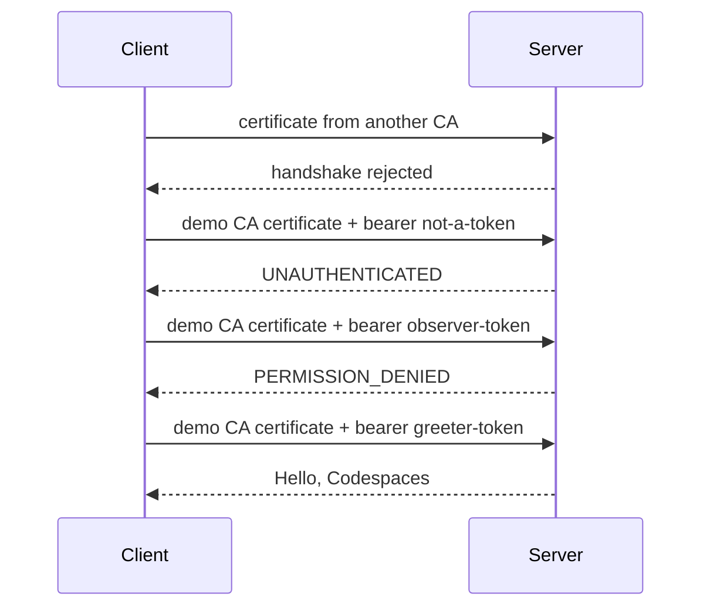
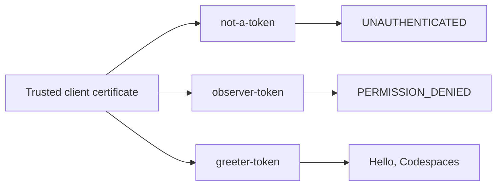
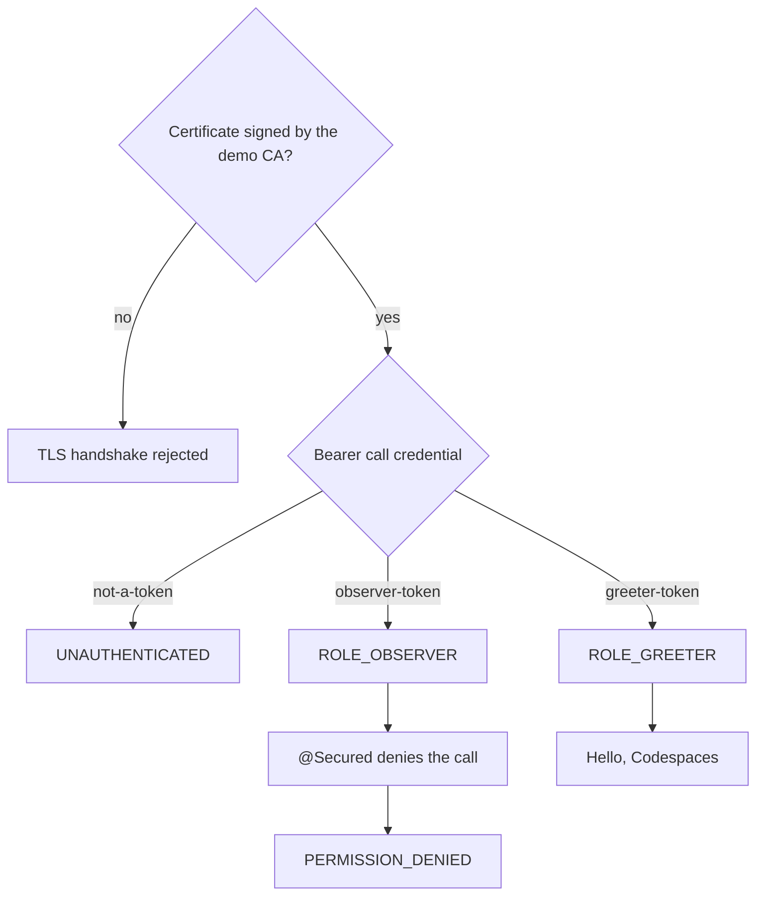

# gRPC client and server on Spring Boot 2.7

Small mutual-TLS example. Spring Boot **2.7.18** is the last 2.7 release. **Java 8** is the oldest Java that Spring Boot 2.x can run.

The server listens only with TLS and **requires** a client certificate (`client-auth: REQUIRE`). The client negotiates **TLS** and presents its certificate. A second call uses a certificate from another CA; the server rejects that handshake. There is no plaintext port.

On that TLS channel the client also sends a bearer call credential (`CallCredentialsHelper.bearerAuth`). Spring Security reads it with `BearerAuthenticationReader` and allows `sayHello` only for `ROLE_GREETER` (`@Secured`). The demo then checks three application results: an unknown token is `UNAUTHENTICATED`, a token without that role is `PERMISSION_DENIED`, and `greeter-token` returns `Hello, Codespaces`.

Certificates are generated into a Compose volume when the stack starts. They are a demo CA, not a trust anchor to reuse.

## Codespaces

Open this repository in a Codespace (the dev container is Java 8 and includes Docker). Then:

```bash
docker compose up --build
```

The client container exits 0 after the checks. Its log should show the stranger certificate rejected, `bearer token rejected`, `spring security denied the role`, then `call credential and spring security succeeded: Hello, Codespaces`.

## Tests

Mutual TLS is required on every call. Compose checks a stranger certificate and then three bearer tokens. The JUnit checks those three bearer tokens with a certificate the demo CA already trusts.

### Compose client

`docker compose up --build` runs `DemoRunner`. The client exits 0 only when all four results match.



### JUnit

`mvn -pl server test` runs `CallCredentialSecurityTest` against the server on a random TLS port.



### How the server classifies a call

`BearerAuthenticationReader` reads the call credential. `AuthenticationManager` accepts only the two demo tokens. `@Secured("ROLE_GREETER")` allows `sayHello`.



## What is pinned

| Piece | Version |
| --- | --- |
| Spring Boot | 2.7.18 |
| Java | 8 |
| grpc-spring-boot-starter | 2.15.0.RELEASE |
| grpc-java | 1.58.0 |
