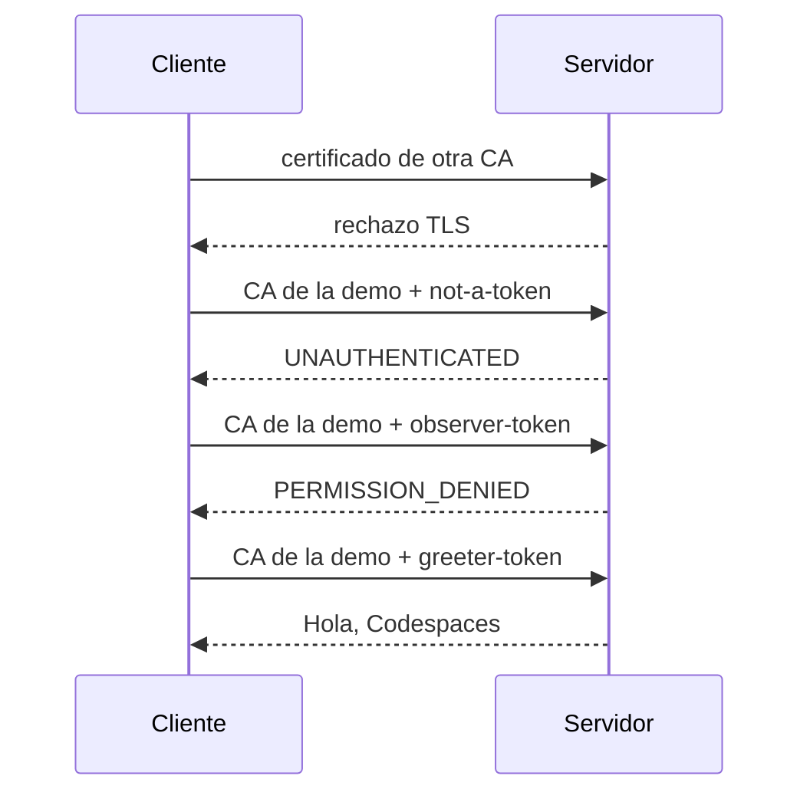
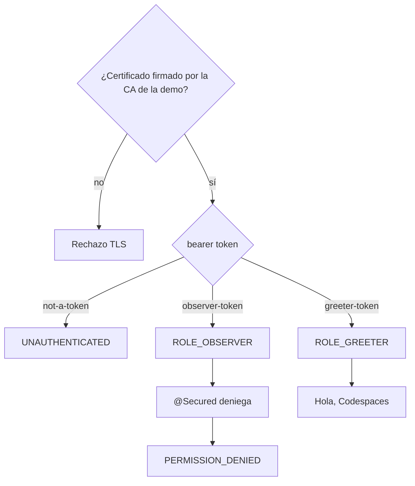

# Cliente y servidor gRPC con Spring Boot 2.7

Dos programas Java **8** y Spring Boot **2.7.18** se llaman por red con **gRPC**. La conexión va siempre cifrada con **TLS**.
La guía de gRPC pide TLS en el canal cuando se usan tokens, y la mayoría de
implementaciones no envían credenciales por un canal sin cifrar.

gRPC distingue **channel credentials** (TLS, en el canal) y **call
credentials** (en cada llamada). En gRPC lo habitual es:

- **Bearer token** como `CallCredentials`: va en cada llamada, normalmente en
  la cabecera `authorization` del metadata. Suele ser un access token
  OAuth 2.0, a menudo con formato JWT. Si es un JWT, firma, caducidad y roles
  van en las claims (en Spring Security, `JwtAuthenticationToken`).
- **Client certificate** (mutual TLS, mTLS): el cliente se autentica en el handshake TLS
  con un certificado x509. El subject puede bastar como identidad, sin un
  segundo token.
- **Los dos**: mTLS en el canal y bearer token en cada llamada. gRPC combina
  channel credentials y call credentials para eso.

Este ejemplo es **los dos**: mTLS abre el canal; un bearer token
(por simplicidad no es un JWT) decide el permiso.

El servidor exige certificado de cliente (`client-auth: REQUIRE`). Si lo firma
otra CA, se rechaza el handshake TLS y no se llega al token. Si es la CA de la
demo, el cliente envía el bearer token (`CallCredentialsHelper.bearerAuth`).
Spring Security lo lee (`BearerAuthenticationReader`) y
`@Secured("ROLE_GREETER")` solo permite `sayHello` a ese rol.

`BearerAuthenticationReader` convierte esa cadena en un
`PreAuthenticatedAuthenticationToken`: el bearer token ya viene en el
metadata. Un `AuthenticationProvider` propio comprueba si es `greeter-token`
u `observer-token` y asigna el rol adecuado. Se usa
`PreAuthenticatedAuthenticationToken` por simplicidad ya que no usamos JWT.

Una **CA** firma certificados y dice «este servidor / este cliente es de los
nuestros». `scripts/generate-certs.sh`
crea al arrancar Compose una CA autofirmada (`CN=demo-ca`, ficheros `ca.crt`
y `ca.key` en `/certs`). Esa CA firma el certificado del servidor
(`CN=server`) y el del cliente de confianza (`CN=demo-client`). Servidor y
cliente solo confían en `ca.crt` (`trust-cert-collection`).

El script crea **otra** CA (`CN=stranger-ca`) y un certificado extraño. El
servidor no tiene esa CA en el trust store: si el cliente usa ese
certificado, el handshake falla. Así se ve qué pasa si el client certificate
no es de «nuestra» CA.

## Ejecución

Codespace con Java 8 y Docker:

```bash
docker compose up --build
```

El cliente (`DemoRunner`) sale con código 0 solo si se cumplen, en este orden:

1. petición con certificado de otra CA → rechazo TLS
2. petición con certificado de la CA de la demo + `not-a-token` → `UNAUTHENTICATED`
3. petición con el mismo certificado + `observer-token` → `PERMISSION_DENIED`
4. petición con el mismo certificado + `greeter-token` → `Hola, Codespaces`

En el log: `certificado extraño rechazado`, `bearer token rechazado`,
`Spring Security denegó el rol`,
`call credential y Spring Security correctos: Hola, Codespaces`.

```bash
mvn -pl server test
```

`CallCredentialSecurityTest` levanta el servidor en un puerto TLS aleatorio.





## Versiones

| Componente | Versión |
| --- | --- |
| Spring Boot | 2.7.18 |
| Java | 8 |
| grpc-spring-boot-starter | 2.15.0.RELEASE |
| grpc-java | 1.58.0 |

## Fuentes

- [gRPC: Authentication](https://grpc.io/docs/guides/auth/): channel y call
  credentials, TLS con client certificate opcional, tokens OAuth 2.0 por
  llamada sobre TLS.
- [grpc-spring: Server Security](https://grpc-ecosystem.github.io/grpc-spring/en/server/security.html):
  `client-auth: REQUIRE`, `trust-cert-collection`, `BearerAuthenticationReader`
  y `@Secured`.
- [grpc-spring: Client Security](https://grpc-ecosystem.github.io/grpc-spring/en/client/security.html):
  certificado de cliente y `CallCredentialsHelper.bearerAuth`.
- [Spring Security 5.7.11: `PreAuthenticatedAuthenticationToken`](https://docs.spring.io/spring-security/site/docs/5.7.11/api/org/springframework/security/web/authentication/preauth/PreAuthenticatedAuthenticationToken.html)
- [Spring Security 5.7.11: `JwtAuthenticationToken`](https://docs.spring.io/spring-security/site/docs/5.7.11/api/org/springframework/security/oauth2/server/resource/authentication/JwtAuthenticationToken.html)
