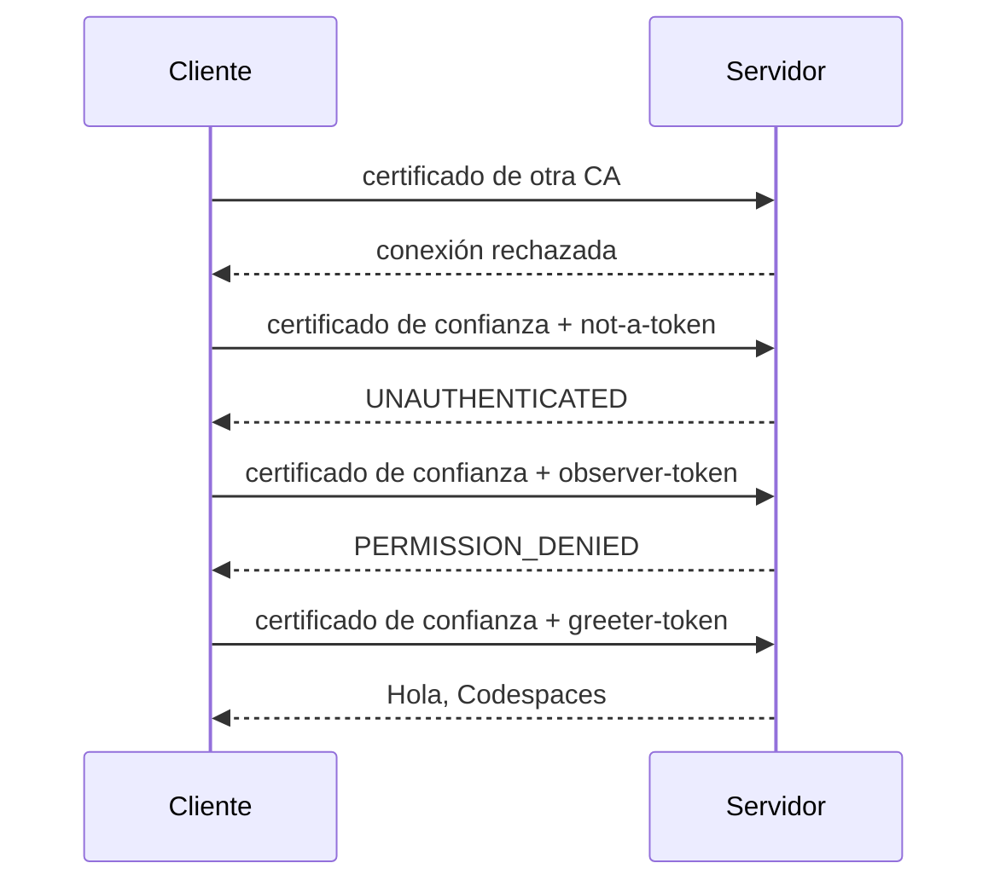
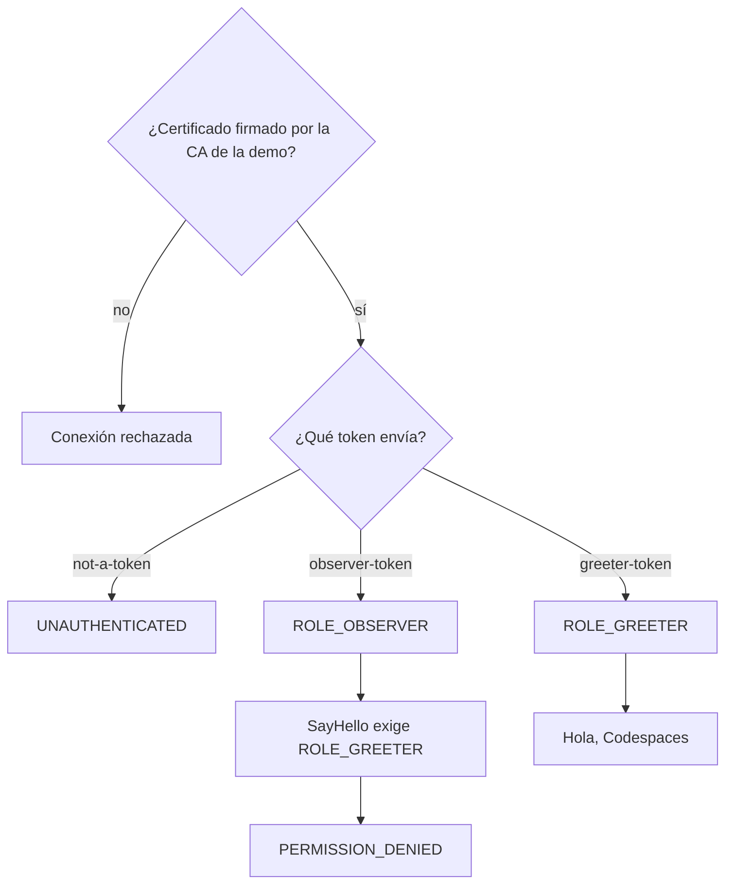
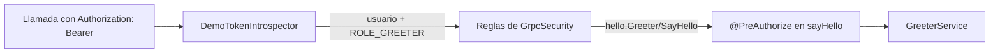

# Cliente y servidor gRPC con mTLS y tokens (Spring Boot 4)

[](https://github.com/IAAA-Lab/grpc-springboot2-mtls/actions/workflows/ci.yml)

## Qué muestra

Cuando dos servicios de backend se comunican por red, hay que asegurar dos
cosas: que solo hablan entre sí servicios de confianza, y que cada uno solo
puede hacer lo que tiene permitido.

Este repositorio lo muestra con dos programas, un cliente y un servidor, que se
comunican con **gRPC**. La seguridad se aplica en dos niveles independientes:

1. **En la conexión:** solo se abre si los dos extremos presentan un
   certificado de confianza (mutual TLS).
2. **En cada llamada:** el cliente envía un token; según ese token, el servidor
   decide si la llamada está permitida.

Si falla el primer nivel, no se llega al segundo; si se supera el primero, el
segundo sigue filtrando. Es una forma de **defensa en profundidad**. El ejemplo
usa **Java 25**, **Spring Boot 4.0** y **Spring gRPC 1.0**.

La versión anterior, con Java 8 y Spring Boot 2.7, sigue disponible en la
etiqueta [`springboot-2.7`](https://github.com/IAAA-Lab/grpc-springboot2-mtls/tree/springboot-2.7).

## Conceptos

- **gRPC**: una forma de que un programa llame a funciones de otro programa por
  red. Las funciones disponibles se describen en un fichero `.proto`; aquí hay
  una sola, `SayHello`, que recibe un nombre y devuelve un saludo.
- **TLS**: el cifrado que protege la conexión, el mismo que usa HTTPS.
- **Certificado**: un documento digital que identifica a un programa. Lo firma
  una **CA** (autoridad de certificación); quien confía en esa CA acepta los
  certificados que firma.
- **Mutual TLS (mTLS)**: TLS en el que se identifican los dos extremos. Además
  del servidor, el cliente presenta su certificado, y el servidor rechaza la
  conexión si no está firmado por una CA de confianza.
- **Token** (bearer token): una cadena de texto que el cliente envía en cada
  llamada para demostrar quién es. Quien lo tiene («bearer», el portador) puede
  usarlo.
- **Rol**: un permiso con nombre, por ejemplo `ROLE_GREETER`. El servidor asigna
  un rol según el token y cada función exige un rol concreto.
- **Spring Security**: la librería de Spring que lee el token, asigna el rol y
  deniega las llamadas sin permiso.

## Los dos niveles en gRPC

gRPC distingue **channel credentials**, que protegen la conexión (TLS), y
**call credentials**, que acompañan a cada llamada. La guía de gRPC pide TLS
en la conexión cuando se usan tokens, y la mayoría de implementaciones no
envían credenciales por una conexión sin cifrar.

Con esos dos niveles hay tres combinaciones habituales:

- **Solo token** (sobre TLS): el token va en cada llamada, normalmente en la cabecera
  `authorization` de los metadatos de gRPC. Suele ser un access token
  OAuth 2.0, a menudo con formato JWT. Si es un JWT, la firma, la caducidad y
  los roles van dentro del propio token.
- **Solo certificado de cliente (mTLS):** el cliente se identifica al abrir la
  conexión. El nombre del certificado puede bastar como identidad, sin un
  segundo token.
- **Los dos:** mTLS en la conexión y token en cada llamada.

Este ejemplo usa **los dos**: mTLS decide quién puede conectarse y el token
decide qué puede hacer. Por simplicidad, el token es una cadena fija y no un
JWT.

## Qué contiene el repositorio

- `api`: la definición gRPC (`hello.proto`) y los tokens de la demo
  (`DemoTokens`), compartidos por cliente y servidor.
- `server`: el servidor. Solo acepta conexiones con mTLS y protege `SayHello`
  con Spring Security.
- `client`: el cliente (`DemoRunner`). Hace cuatro llamadas de prueba y
  comprueba el resultado de cada una.
- `scripts/generate-certs.sh`: crea los certificados de la demo.
- `docker-compose.yml`: arranca los certificados, el servidor y el cliente.
- `.github/workflows/ci.yml`: ejecuta los tests y la demo en cada cambio.

### Certificados de la demo

Al arrancar, `scripts/generate-certs.sh` crea:

- una CA de la demo (`CN=demo-ca`);
- el certificado del servidor (`CN=server`), firmado por esa CA;
- el certificado del cliente de confianza (`CN=demo-client`), firmado por esa
  CA;
- *otra* CA (`CN=stranger-ca`) y un certificado firmado por ella.

Servidor y cliente solo confían en la CA de la demo. El certificado firmado por la *otra* CA sirve para ver qué pasa cuando un cliente se presenta con un certificado que no es de «nuestra» CA.

### Tokens y roles de la demo

| Token | Rol asignado | Resultado al llamar a `SayHello` |
| --- | --- | --- |
| `greeter-token` | `ROLE_GREETER` | permitido |
| `observer-token` | `ROLE_OBSERVER` | denegado: no tiene el rol necesario |
| `not-a-token` | ninguno | rechazado: token desconocido |

## Demostración

Abre el repositorio en un Codespace (en GitHub: «Code» → «Codespaces» →
«Create codespace on main»). El entorno ya trae Java 25, Maven y Docker. En el
terminal, ejecuta:

```bash
docker compose up --build
```

Docker crea los certificados, arranca el servidor y después el cliente. El
cliente espera a que el servidor esté listo y hace cuatro llamadas, en este
orden:

1. Con el certificado ajeno: el servidor rechaza la conexión y la llamada ni
   siquiera llega a enviarse.
2. Con el certificado de confianza y `not-a-token`: la conexión se abre, pero
   el token no es válido (`UNAUTHENTICATED`).
3. Con el certificado de confianza y `observer-token`: el token es válido, pero
   su rol no tiene permiso (`PERMISSION_DENIED`).
4. Con el certificado de confianza y `greeter-token`: la llamada se acepta y el
   servidor responde `Hola, Codespaces`.

En el log aparecen, en ese orden: `servidor listo`,
`certificado ajeno rechazado en el handshake TLS`, `bearer token rechazado`,
`Spring Security denegó el rol` y
`mTLS, bearer token y rol correctos: Hola, Codespaces`. El cliente termina con
código 0 solo si las cuatro llamadas dan el resultado esperado.



El servidor decide así:



## Tests

```bash
mvn verify
```

`GrpcSecurityTest` crea sus propios certificados con
`scripts/generate-certs.sh` en un directorio temporal y arranca el servidor
real, con mTLS, en un puerto aleatorio. Comprueba:

- las cuatro llamadas de la demo, incluido el certificado ajeno;
- que una llamada sin token o con usuario y contraseña (HTTP Basic) también se
  rechaza (`UNAUTHENTICATED`);
- que el servicio Health responde sin token y que Reflection no está expuesto;
- que `@PreAuthorize` deniega el rol `ROLE_OBSERVER` aunque se llame al
  servicio directamente, sin pasar por la red.

## Integración continua

En cada push, a cualquier rama, y en cada pull request a `main`, GitHub
Actions ejecuta dos trabajos:

- **maven**: `mvn -B -ntp verify` con Java 25, que compila los tres módulos y
  pasa los tests;
- **demo**: `docker compose run --build --rm client`, que arranca los
  certificados y el servidor, ejecuta el cliente y falla si este no termina con
  código 0.

Dependabot propone cada semana actualizaciones de Maven, de las acciones de
GitHub y de las imágenes Docker (`Dockerfile` y `docker-compose.yml`).

## Detalles técnicos

Esta sección es para quien quiera ver cómo está hecho.

### Conexión (mTLS)

Los certificados se declaran como **SSL bundles** de Spring Boot
(`spring.ssl.bundle.pem.*`): cada bundle junta un certificado, su clave privada
y la CA en la que confía.

- El servidor usa el bundle `server` y exige certificado de cliente
  (`spring.grpc.server.ssl.client-auth: require`).
- El cliente define dos canales con nombre: `greeter`, con el bundle `client`
  (certificado de confianza), y `stranger`, con el bundle `stranger`
  (certificado de la otra CA). Los dos confían solo en `ca.crt`.

Todo está en el `application.yml` de cada módulo.

### Del token al rol

La relación entre token y rol vive solo en el servidor; el cliente solo envía
el token.

- El cliente añade el token a cada llamada con
  `BearerTokenAuthenticationInterceptor`, que lo pone en la cabecera
  `authorization` como `Bearer <token>`.
- En el servidor, `GrpcSecurity` lee esa cabecera y se la pasa a
  `DemoTokenIntrospector`, un `OpaqueTokenIntrospector` de Spring Security. Si
  el token es `greeter-token` u `observer-token`, devuelve el usuario y su
  rol; cualquier otro token se rechaza (`UNAUTHENTICATED`).
- Las reglas de acceso están en `GrpcSecurityConfiguration`:
  `hello.Greeter/SayHello` exige `ROLE_GREETER`, el servicio Health queda
  abierto para saber si el servidor está listo, y todo lo demás se deniega.
- `@PreAuthorize("hasRole('GREETER')")` en `sayHello` repite la regla en el
  propio método. La primera regla protege la entrada por gRPC; la segunda
  protege el método aunque alguien lo llame por otro camino.

Si falta el rol, la respuesta es `PERMISSION_DENIED`.



### Ya aplicado en la demo

- **Reflection** desactivado (`spring.grpc.server.reflection.enabled: false`)
  para no publicar la definición de los servicios.
- **Plazos:** cada llamada del cliente lleva un deadline.

### En producción

- **Tokens:** `DemoTokenIntrospector` se sustituye por la introspección del
  servidor de autorización (`introspectionUri`, RFC 7662) o por JWT
  (`.jwt(...)`). Las reglas de acceso no cambian.
- **Certificados:** mejor de corta duración y renovados automáticamente.
  Spring Boot puede recargar un bundle sin reiniciar (`reload-on-update`), pero
  solo en los componentes que lo admiten, como Tomcat o Netty para HTTP; el
  servidor de Spring gRPC 1.0 no lo admite, así que renovar un certificado
  exige reiniciar el servidor.

## Versiones

| Componente | Versión |
| --- | --- |
| Java | 25 |
| Spring Boot | 4.0.8 |
| Spring gRPC | 1.0.3 |
| Spring Security | 7.0.7 |
| grpc-java | 1.77.1 |
| protobuf-java | 4.33.4 |

## Fuentes

- [gRPC: Authentication](https://grpc.io/docs/guides/auth/): channel y call
  credentials, TLS con client certificate opcional, tokens OAuth 2.0 por
  llamada sobre TLS.
- [Spring gRPC: GRPC Server](https://docs.spring.io/spring-grpc/reference/server.html):
  SSL bundles en el servidor, `GrpcSecurity`, `authorizeRequests`,
  `oauth2ResourceServer` y `@PreAuthorize`.
- [Spring gRPC: GRPC Clients](https://docs.spring.io/spring-grpc/reference/client.html):
  canales con nombre, SSL bundles en el cliente y
  `BearerTokenAuthenticationInterceptor`.
- [Spring Boot: SSL](https://docs.spring.io/spring-boot/reference/features/ssl.html):
  bundles PEM y recarga de certificados.
- [Spring Security: OAuth 2.0 Resource Server Opaque Token](https://docs.spring.io/spring-security/reference/servlet/oauth2/resource-server/opaque-token.html):
  `OpaqueTokenIntrospector` y roles a partir del token.
- [OWASP: gRPC Security Cheat Sheet](https://cheatsheetseries.owasp.org/cheatsheets/gRPC_Security_Cheat_Sheet.html):
  TLS, mTLS, tokens en metadatos y deadlines.
