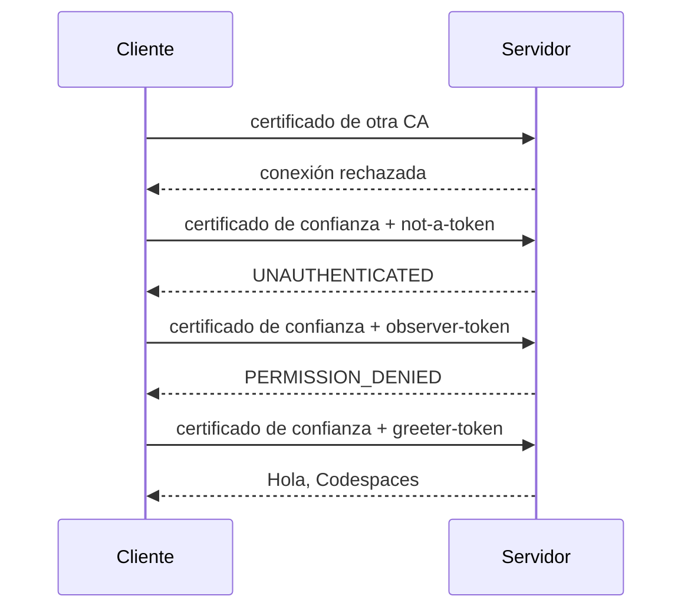
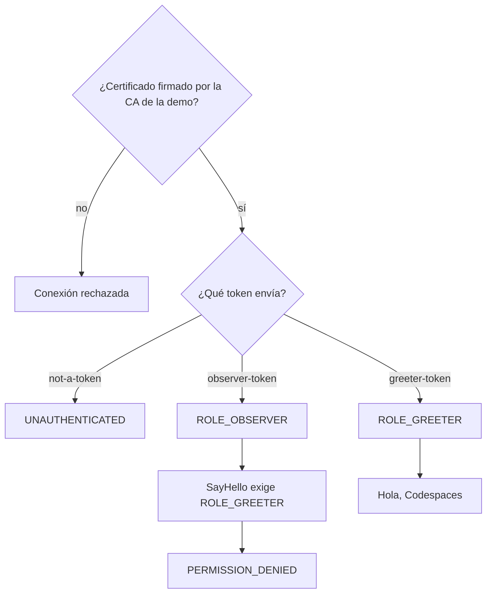

# Cliente y servidor gRPC con Spring Boot 2.7

## Qué muestra

Cuando dos servicios de backend se comunican por red, hay que asegurar dos
cosas: que solo hablan entre sí servicios de confianza, y que cada uno solo
puede hacer lo que tiene permitido.

Este repositorio lo muestra con dos programas, un cliente y un servidor, que se
comunican con **gRPC**. La seguridad se aplica en dos niveles independientes:

1. **En la conexión:** solo se abre si los dos extremos presentan un
   certificado de confianza (mutual TLS).
2. **En cada llamada:** el cliente envía un token; según ese token, el servidor
   decide si la llamada está permitida.

Si falla el primer nivel, no se llega al segundo; si se supera el primero, el
segundo sigue filtrando. Es una forma de **defensa en profundidad**. El ejemplo
usa **Java 8** y **Spring Boot 2.7.18**.

## Conceptos

- **gRPC**: una forma de que un programa llame a funciones de otro programa por
  red. Las funciones disponibles se describen en un fichero `.proto`; aquí hay
  una sola, `SayHello`, que recibe un nombre y devuelve un saludo.
- **TLS**: el cifrado que protege la conexión, el mismo que usa HTTPS.
- **Certificado**: un documento digital que identifica a un programa. Lo firma
  una **CA** (autoridad de certificación); quien confía en esa CA acepta los
  certificados que firma.
- **Mutual TLS (mTLS)**: TLS en el que se identifican los dos extremos. Además
  del servidor, el cliente presenta su certificado, y el servidor rechaza la
  conexión si no está firmado por una CA de confianza.
- **Token** (bearer token): una cadena de texto que el cliente envía en cada
  llamada para demostrar quién es. Quien lo tiene («bearer», el portador) puede
  usarlo.
- **Rol**: un permiso con nombre, por ejemplo `ROLE_GREETER`. El servidor asigna
  un rol según el token y cada función exige un rol concreto.
- **Spring Security**: la librería de Spring que lee el token, asigna el rol y
  deniega las llamadas sin permiso.

## Los dos niveles en gRPC

gRPC distingue **channel credentials**, que protegen la conexión (TLS), y
**call credentials**, que acompañan a cada llamada. La guía de gRPC pide TLS
en la conexión cuando se usan tokens, y la mayoría de implementaciones no
envían credenciales por una conexión sin cifrar.

Con esos dos niveles hay tres combinaciones habituales:

- **Solo token** (sobre TLS): el token va en cada llamada, normalmente en la cabecera
  `authorization` de los metadatos de gRPC. Suele ser un access token
  OAuth 2.0, a menudo con formato JWT. Si es un JWT, la firma, la caducidad y
  los roles van dentro del propio token.
- **Solo certificado de cliente (mTLS):** el cliente se identifica al abrir la
  conexión. El nombre del certificado puede bastar como identidad, sin un
  segundo token.
- **Los dos:** mTLS en la conexión y token en cada llamada.

Este ejemplo usa **los dos**: mTLS decide quién puede conectarse y el token
decide qué puede hacer. Por simplicidad, el token es una cadena fija y no un
JWT.

## Qué contiene el repositorio

- `api`: la definición gRPC (`hello.proto`) y los tokens de la demo
  (`DemoTokens`), compartidos por cliente y servidor.
- `server`: el servidor. Solo acepta conexiones con mTLS y protege `SayHello`
  con Spring Security.
- `client`: el cliente (`DemoRunner`). Hace cuatro llamadas de prueba y
  comprueba el resultado de cada una.
- `scripts/generate-certs.sh`: crea los certificados de la demo.
- `docker-compose.yml`: arranca los certificados, el servidor y el cliente.

### Certificados de la demo

Al arrancar, `scripts/generate-certs.sh` crea:

- una CA de la demo (`CN=demo-ca`);
- el certificado del servidor (`CN=server`), firmado por esa CA;
- el certificado del cliente de confianza (`CN=demo-client`), firmado por esa
  CA;
- *otra* CA (`CN=stranger-ca`) y un certificado firmado por ella.

Servidor y cliente solo confían en la CA de la demo. El certificado firmado por la *otra* CA sirve para ver qué pasa cuando un cliente se presenta con un certificado que no es de «nuestra» CA.

### Tokens y roles de la demo

| Token | Rol asignado | Resultado al llamar a `SayHello` |
| --- | --- | --- |
| `greeter-token` | `ROLE_GREETER` | permitido |
| `observer-token` | `ROLE_OBSERVER` | denegado: no tiene el rol necesario |
| `not-a-token` | ninguno | rechazado: token desconocido |

## Demostración

Abre el repositorio en un Codespace (en GitHub: «Code» → «Codespaces» →
«Create codespace on main»). El entorno ya trae Java 8 y Docker. En el
terminal, ejecuta:

```bash
docker compose up --build
```

Docker crea los certificados, arranca el servidor y después el cliente. El
cliente hace cuatro llamadas, en este orden:

1. Con el certificado ajeno: el servidor rechaza la conexión y la llamada ni
   siquiera llega a enviarse.
2. Con el certificado de confianza y `not-a-token`: la conexión se abre, pero
   el token no es válido (`UNAUTHENTICATED`).
3. Con el certificado de confianza y `observer-token`: el token es válido, pero
   su rol no tiene permiso (`PERMISSION_DENIED`).
4. Con el certificado de confianza y `greeter-token`: la llamada se acepta y el
   servidor responde `Hola, Codespaces`.

En el log aparecen, en ese orden: `certificado ajeno rechazado`,
`bearer token rechazado`, `Spring Security denegó el rol` y
`call credential y Spring Security correctos: Hola, Codespaces`. El cliente
termina con código 0 solo si las cuatro llamadas dan el resultado esperado.



El servidor decide así:



## Tests

```bash
mvn -pl server test
```

`CallCredentialSecurityTest` genera sus propios certificados con `openssl` en
un directorio temporal, arranca el servidor en un puerto aleatorio con mTLS y
comprueba los tres tokens con el certificado de confianza. El caso del
certificado ajeno solo se comprueba en la demo con Docker.

## Detalles técnicos

Esta sección es para quien quiera ver cómo está hecho.

### Conexión (mTLS)

El servidor exige certificado de cliente (`client-auth: REQUIRE`) y solo
confía en `ca.crt` (`trust-cert-collection`). El cliente activa su
certificado (`client-auth-enabled: true`) y también confía solo en `ca.crt`.
Todo está en el `application.yml` de cada módulo.

### Llamada (token y rol)

- El cliente añade el token a cada llamada con
  `CallCredentialsHelper.bearerAuth`.
- En el servidor, `BearerAuthenticationReader` lee el token de los metadatos y
  lo entrega a Spring Security como un `PreAuthenticatedAuthenticationToken`.
- Un `AuthenticationProvider` propio comprueba si es `greeter-token` u
  `observer-token` y asigna el rol; cualquier otro token se rechaza.
- `@Secured("ROLE_GREETER")` en `sayHello` solo deja pasar ese rol.

Se usa `PreAuthenticatedAuthenticationToken` por simplicidad, porque el token
no es un JWT. Con JWT reales, Spring Security valida la firma y lee los roles
del propio token (`JwtAuthenticationToken`).

## Versiones

| Componente | Versión |
| --- | --- |
| Spring Boot | 2.7.18 |
| Java | 8 |
| grpc-spring-boot-starter | 2.15.0.RELEASE |
| grpc-java | 1.58.0 |

## Fuentes

- [gRPC: Authentication](https://grpc.io/docs/guides/auth/): channel y call
  credentials, TLS con client certificate opcional, tokens OAuth 2.0 por
  llamada sobre TLS.
- [grpc-spring: Server Security](https://grpc-ecosystem.github.io/grpc-spring/en/server/security.html):
  `client-auth: REQUIRE`, `trust-cert-collection`, `BearerAuthenticationReader`
  y `@Secured`.
- [grpc-spring: Client Security](https://grpc-ecosystem.github.io/grpc-spring/en/client/security.html):
  certificado de cliente y `CallCredentialsHelper.bearerAuth`.
- [Spring Security 5.7.11: `PreAuthenticatedAuthenticationToken`](https://docs.spring.io/spring-security/site/docs/5.7.11/api/org/springframework/security/web/authentication/preauth/PreAuthenticatedAuthenticationToken.html)
- [Spring Security 5.7.11: `JwtAuthenticationToken`](https://docs.spring.io/spring-security/site/docs/5.7.11/api/org/springframework/security/oauth2/server/resource/authentication/JwtAuthenticationToken.html)
